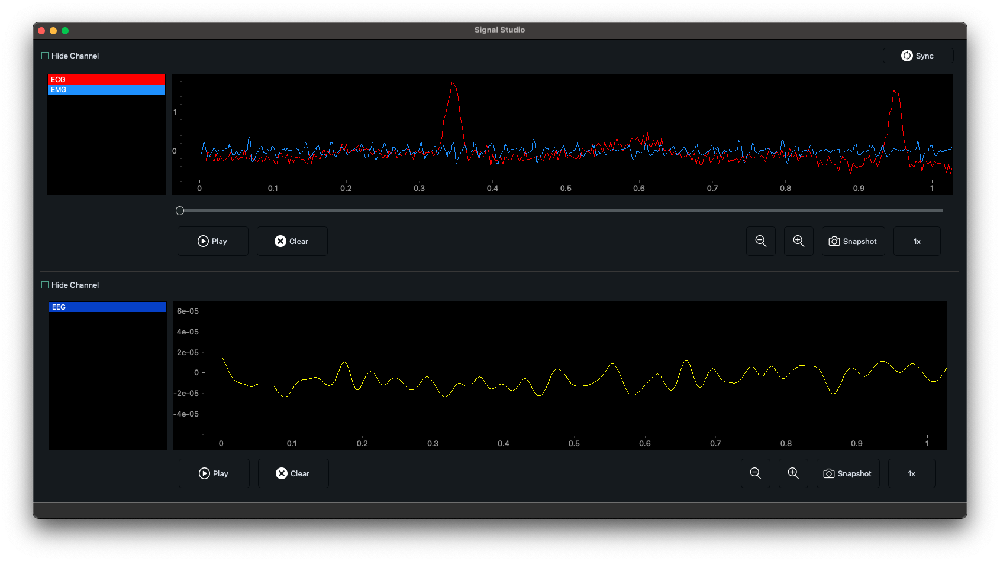

# Signal Viewer Desktop App Readme

## Introduction

Welcome to the Signal Viewer Desktop App! This PyQt-based application allows you to view and manipulate signals in real-time. You can visualize two channels simultaneously, add, delete, hide, and change the color of signals within each channel. This readme provides essential information to get you started with the application.

## Features

- **Signal Visualization:** The app provides a graphical interface to view signals in real-time, making it easy to analyze data.

- **Multiple Channels:** You can work with two channels at the same time, allowing you to compare and contrast different signals.

- **Signal Manipulation:**
  - **Add Signals:** You can add new signals to each channel, providing flexibility in data analysis.
  - **Delete Signals:** Unwanted signals can be deleted with a simple action, decluttering your view.
  - **Hide Signals:** If you want to focus on specific signals, you can hide others to simplify the display.
  - **Change Signal Color:** Customize the appearance of each signal by changing its color to enhance visibility.



- **Installation:**

  - Prerequisites:

    - Python 3.6 or higher installed
    - Git installed

  - Clone the repository:

    ```
    git clone <repo_url>
    ```

    This will create a local copy of the repository on your machine. Replace the `<repo_url>` with the url of this github repository

  - Navigate to the project directory:

    ```
    cd signal_studio
    ```

    Change to the directory where the repository was cloned.

  - Install the required dependencies:

    ```
    pip install -r requirements.txt
    ```

    This will install all the necessary dependencies for the application.

  - Run the application:
    ```
    python index.py
    ```
    This will start the Signal Viewer Desktop App.
